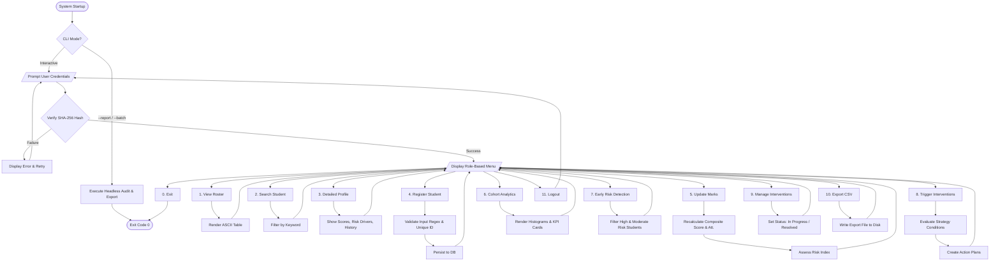
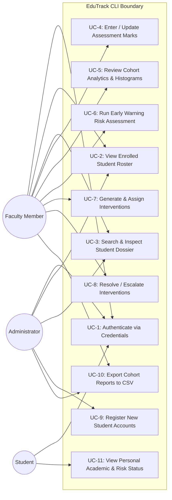
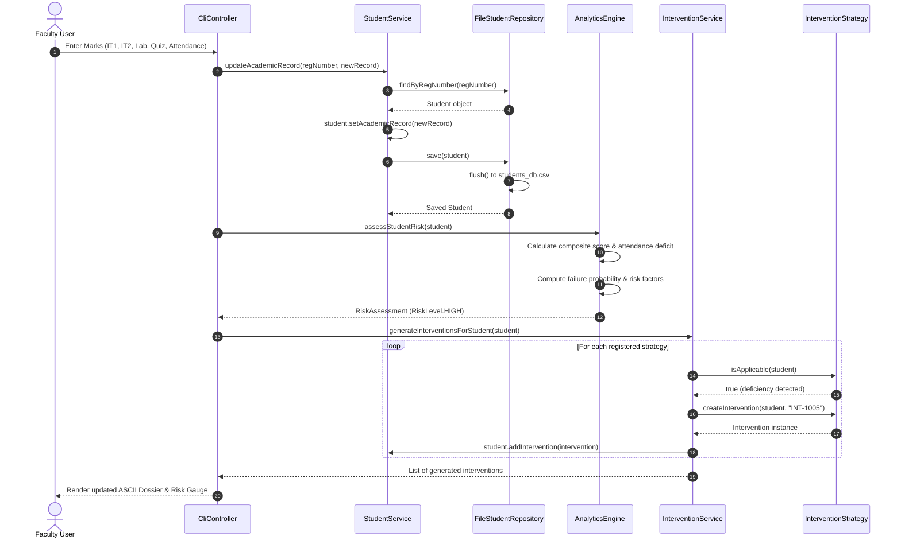
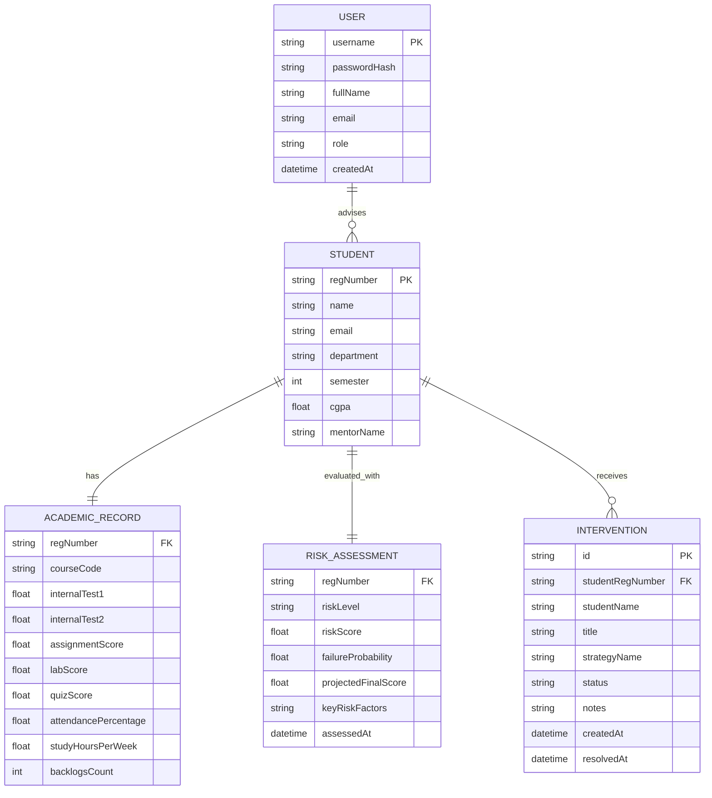

# EduTrack: System Design & Architectural Artefacts

This document provides formal architectural models and UML design diagrams for the **EduTrack** Academic Performance Analytics and Student Intervention System, satisfying Section 4 of the VITyarthi project submission requirements.

---

## 1. System Architecture Diagram

EduTrack adheres to a strict **Layered Architecture** with distinct separation of concerns:

```mermaid
graph TD
    subgraph Presentation Layer [Presentation Layer: CLI & Terminal UI]
        CLI[CliController]
        MENU[MenuOption & InputValidator]
        RENDER[TableRenderer & AsciiChartRenderer]
        CLI --> MENU
        CLI --> RENDER
    end

    subgraph Service Layer [Service / Business Logic Layer]
        AUTH[AuthService]
        STUDENT_SVC[StudentService]
        ANALYTICS[AnalyticsEngine]
        INTERVENTION_SVC[InterventionService]
    end

    subgraph Strategy Layer [Behavioral Strategy Layer]
        STRAT[InterventionStrategy Interface]
        REM[RemedialClassStrategy]
        ATT[AttendanceCounselingStrategy]
        PEER[PeerTutoringStrategy]
        STRAT --> REM
        STRAT --> ATT
        STRAT --> PEER
    end

    subgraph Domain Layer [Domain Models & Entities]
        USER[User / FacultyUser / StudentUser / AdminUser]
        STUDENT[Student Aggregate]
        RECORD[AcademicRecord]
        ASSESSMENT[RiskAssessment]
        INTERVENT[Intervention]
    end

    subgraph Persistence Layer [Data Access & Persistence Layer]
        REPO[StudentRepository Interface]
        INMEM[InMemoryStudentRepository]
        FILE_REPO[FileStudentRepository]
        CSV[CsvHandler Utility]
        STORAGE[(students_db.csv / students_seed.csv)]

        REPO --> INMEM
        INMEM --> FILE_REPO
        FILE_REPO --> CSV
        CSV --> STORAGE
    end

    CLI --> AUTH
    CLI --> STUDENT_SVC
    CLI --> ANALYTICS
    CLI --> INTERVENTION_SVC

    STUDENT_SVC --> REPO
    INTERVENTION_SVC --> STRAT
    INTERVENTION_SVC --> Domain Layer
    ANALYTICS --> Domain Layer
    STUDENT_SVC --> Domain Layer
```

---

## 2. Process Flow / Workflow Diagram

Illustrates the end-to-end operational flow from user authentication through continuous assessment evaluation, automated risk detection, and intervention resolution:



---

## 3. UML Use Case Diagram

Defines interactions between system actors (Faculty, Administrator, Student) and primary use cases:



---

## 4. UML Class Diagram

Captures object-oriented class relationships, inheritance hierarchies, and design patterns:

```mermaid
classDiagram
    %% Inheritance Hierarchy
    class User {
        <<abstract>>
        -String username
        -String passwordHash
        -String fullName
        -String email
        -UserRole role
        +getDashboardCapabilities()* List~String~
    }

    class FacultyUser {
        -String department
        -String employeeId
        +getDashboardCapabilities() List~String~
    }

    class StudentUser {
        -String registrationNumber
        +getDashboardCapabilities() List~String~
    }

    class AdminUser {
        +getDashboardCapabilities() List~String~
    }

    User <|-- FacultyUser
    User <|-- StudentUser
    User <|-- AdminUser

    %% Domain Aggregates
    class Student {
        -String regNumber
        -String name
        -String email
        -String department
        -int semester
        -double cgpa
        -String mentorName
        -AcademicRecord academicRecord
        -RiskAssessment riskAssessment
        -List~Intervention~ interventions
        +addIntervention(Intervention)
    }

    class AcademicRecord {
        -String courseCode
        -double internalTest1
        -double internalTest2
        -double assignmentScore
        -double labScore
        -double quizScore
        -double attendancePercentage
        -double studyHoursPerWeek
        -int backlogsCount
        +calculateCompositeScore() double
        +isAttendanceDeficient() boolean
        +isFailingComposite() boolean
    }

    class RiskAssessment {
        -RiskLevel riskLevel
        -double riskScore
        -double failureProbability
        -double projectedFinalScore
        -List~String~ keyRiskFactors
        -String recommendation
    }

    class Intervention {
        -String id
        -String studentRegNumber
        -String studentName
        -String title
        -String strategyName
        -InterventionStatus status
        -String notes
    }

    Student *-- AcademicRecord
    Student *-- RiskAssessment
    Student o-- Intervention

    %% Strategy Pattern Hierarchy
    class InterventionStrategy {
        <<interface>>
        +getStrategyName() String
        +isApplicable(Student) boolean
        +createIntervention(Student, String) Intervention
    }

    class RemedialClassStrategy {
        +isApplicable(Student) boolean
        +createIntervention(Student, String) Intervention
    }

    class AttendanceCounselingStrategy {
        +isApplicable(Student) boolean
        +createIntervention(Student, String) Intervention
    }

    class PeerTutoringStrategy {
        +isApplicable(Student) boolean
        +createIntervention(Student, String) Intervention
    }

    InterventionStrategy <|.. RemedialClassStrategy
    InterventionStrategy <|.. AttendanceCounselingStrategy
    InterventionStrategy <|.. PeerTutoringStrategy

    %% Repository Hierarchy
    class StudentRepository {
        <<interface>>
        +save(Student) Student
        +findByRegNumber(String) Optional~Student~
        +findAll() List~Student~
        +deleteByRegNumber(String) boolean
    }

    class InMemoryStudentRepository {
        #Map~String, Student~ studentStore
    }

    class FileStudentRepository {
        -File storageFile
        -File seedFile
        +flush()
    }

    StudentRepository <|.. InMemoryStudentRepository
    InMemoryStudentRepository <|-- FileStudentRepository
```



---

## 5. UML Sequence Diagram: Assessment & Intervention Workflow

Illustrates method calls across layers during continuous assessment update and automated intervention generation:



---

## 6. Database / Storage Design

EduTrack utilizes a normalized, relational-equivalent CSV schema with in-memory hash indexing to ensure zero-dependency local execution while maintaining strict referential integrity.

### 6.1 Entity-Relationship (ER) Diagram



### 6.2 Data Schema Specification

| Entity | Field | Type | Constraint | Description |
| :--- | :--- | :--- | :--- | :--- |
| **Student** | `reg_number` | VARCHAR(20) | PRIMARY KEY, UNIQUE | Academic registration code (e.g. `23BCE1001`) |
| | `name` | VARCHAR(100) | NOT NULL | Full name of student |
| | `email` | VARCHAR(100) | NOT NULL, UNIQUE | University institutional email |
| | `department` | VARCHAR(50) | NOT NULL | Academic branch |
| | `semester` | INTEGER | CHECK (1..10) | Current enrolled semester |
| | `cgpa` | DOUBLE | CHECK (0.0..10.0) | Cumulative Grade Point Average |
| | `mentor_name` | VARCHAR(100) | NOT NULL | Faculty proctor name |
| **AcademicRecord** | `course_code` | VARCHAR(20) | NOT NULL | Course code (e.g. `CSE2001`) |
| | `internal_test_1` | DOUBLE | CHECK (0.0..50.0) | Internal Test 1 score |
| | `internal_test_2` | DOUBLE | CHECK (0.0..50.0) | Internal Test 2 score |
| | `assignment_score` | DOUBLE | CHECK (0.0..20.0) | Assignment submission mark |
| | `lab_score` | DOUBLE | CHECK (0.0..30.0) | Lab practical mark |
| | `quiz_score` | DOUBLE | CHECK (0.0..20.0) | Online quiz evaluation mark |
| | `attendance_percentage` | DOUBLE | CHECK (0.0..100.0) | Attendance rate (Statutory min: 75.0%) |
| | `study_hours_per_week` | DOUBLE | CHECK (>=0.0) | Weekly self-study allocation |
| | `backlogs_count` | INTEGER | CHECK (>=0) | Active standing arrears |
| **Intervention** | `id` | VARCHAR(20) | PRIMARY KEY | Unique ID (e.g. `INT-1001`) |
| | `student_reg_number` | VARCHAR(20) | FOREIGN KEY | Target student |
| | `strategy_name` | VARCHAR(60) | NOT NULL | Applied strategy name |
| | `status` | ENUM | NOT NULL | `PENDING`, `IN_PROGRESS`, `RESOLVED` |
| | `created_at` | DATETIME | NOT NULL | Creation timestamp |
