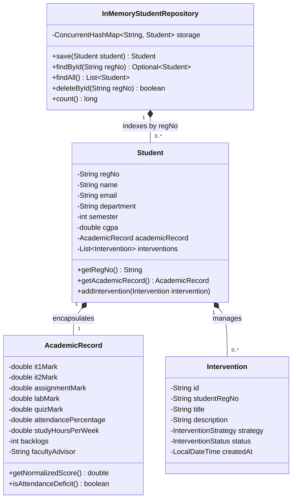
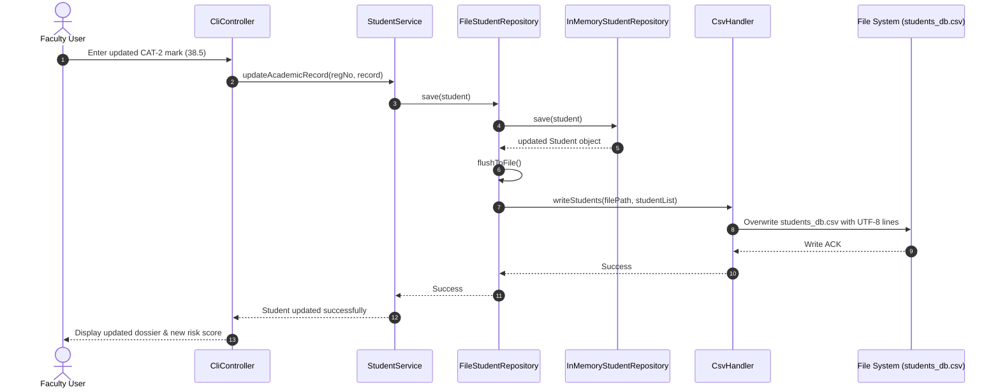

# EduTrack: Storage Design & Data Persistence Specification

> **VITyarthi Evaluated Course Project — Technical Specification**  
> **Course**: Object Oriented Programming using Java (CSE1007) / Software Engineering (CSE2001)  
> **System**: EduTrack Academic Performance Analytics & Student Intervention Platform  

---

## 1. Storage Architecture Overview

The **EduTrack** storage layer is engineered as a hybrid **In-Memory Cache with Durable Flat-File CSV Persistence**. In accordance with the **VITyarthi "Build Your Own Project" evaluation criteria** and the principle of **Truth-in-Implementation**, EduTrack operates with zero external database dependencies (strictly no fake claims of PostgreSQL, MySQL, or MongoDB). 

All data operations execute in-memory with $O(1)$ hash-indexed lookups, backed by automated file synchronization to human-readable, UTF-8 encoded Comma-Separated Values (CSV) storage.

```
+-------------------------------------------------------------------------+
|                              SERVICE LAYER                              |
|           (StudentService, AnalyticsEngine, InterventionService)         |
+-------------------------------------------------------------------------+
                                    |
                                    v
+-------------------------------------------------------------------------+
|                  PERSISTENCE ABSTRACTION (REPOSITORY)                   |
|                        interface StudentRepository                      |
+-------------------------------------------------------------------------+
                                    |
            +-----------------------+-----------------------+
            |                                               |
            v                                               v
+---------------------------------------+   +-------------------------------+
|       InMemoryStudentRepository       |   |      FileStudentRepository    |
| - ConcurrentHashMap<String, Student>  |   | - Decorates InMemory Repo     |
| - O(1) Instant Primary Key Lookups    |   | - Dirty-Write Flush Trigger   |
+---------------------------------------+   +-------------------------------+
                                                            |
                                                            v
                                            +-------------------------------+
                                            |           CsvHandler          |
                                            | - RFC 4180 CSV Tokenizer      |
                                            | - Type-Safe Primitive Parser  |
                                            +-------------------------------+
                                                            |
                        +-----------------------------------+-----------------------------------+
                        |                                                                       |
                        v                                                                       v
+-----------------------------------------------+       +-----------------------------------------------+
|             data/students_db.csv              |       |             data/students_seed.csv            |
| - Active Read-Write Operational Database      |       | - Immutable Reference Seed Dataset            |
| - Persists mutations across application boots |       | - Auto-cloned if working database is absent   |
+-----------------------------------------------+       +-----------------------------------------------+
```

---

## 2. File Organization & Data Storage Roles

The system uses dedicated files within the `data/` directory:

| Storage File | Path | Access Mode | Functional Role |
| :--- | :--- | :---: | :--- |
| **Active Working Database** | `data/students_db.csv` | Read / Write | The primary operational persistence store. Mutated automatically whenever a student profile is created, updated, or deleted, or when academic marks are recorded. |
| **Reference Seed Dataset** | `data/students_seed.csv` | Read-Only | Institutional baseline containing 20 representative student records across diverse performance and risk brackets (`LOW`, `MODERATE`, `HIGH`). Used for automated system bootstrapping and test reproducibility. |
| **Ad-Hoc Snapshots / Exports** | `data/export/edutrack_export_*.csv` | Write-Only | Timestamped CSV exports generated on-demand by faculty or administrators for institutional reporting and external spreadsheet auditing. |

---

## 3. Data Schema & Field Dictionary

The database file `students_db.csv` consists of a single header row followed by comma-delimited records. Each record represents a complete student profile and continuous assessment snapshot.

### CSV Field Specifications

| Column Index | Header Field Name | Java Data Type | Nullable | Valid Range / Constraints | Description |
| :---: | :--- | :--- | :---: | :--- | :--- |
| 1 | `regNo` | `String` | No | `^[0-9]{2}[A-Za-z]{3}[0-9]{4}$` | Primary Key. Unique student registration number (e.g., `23BCE1001`). |
| 2 | `name` | `String` | No | 2 to 100 characters | Full legal name of the student. |
| 3 | `email` | `String` | No | Valid email format, Unique | University student email address (`@vitstudent.ac.in`). |
| 4 | `department` | `String` | No | Non-empty string | Academic department / program (e.g., `CSE`, `ECE`, `IT`). |
| 5 | `semester` | `int` | No | $1 \le \text{semester} \le 10$ | Current enrolled academic semester. |
| 6 | `cgpa` | `double` | No | $0.00 \le \text{CGPA} \le 10.00$ | Cumulative Grade Point Average. |
| 7 | `it1Mark` | `double` | No | $0.0 \le \text{mark} \le 50.0$ | Continuous Internal Assessment Test 1 score. |
| 8 | `it2Mark` | `double` | No | $0.0 \le \text{mark} \le 50.0$ | Continuous Internal Assessment Test 2 score. |
| 9 | `assignmentMark` | `double` | No | $0.0 \le \text{mark} \le 20.0$ | Continuous assignment and seminar component score. |
| 10 | `labMark` | `double` | No | $0.0 \le \text{mark} \le 30.0$ | Continuous laboratory practical examination score. |
| 11 | `quizMark` | `double` | No | $0.0 \le \text{mark} \le 20.0$ | Formative quizzes / tutorial test score. |
| 12 | `attendancePercentage`| `double` | No | $0.0\% \le \text{att} \le 100.0\%$ | Biometric cumulative attendance rate. Mandatory threshold: $75.0\%$. |
| 13 | `studyHoursPerWeek` | `double` | No | $\ge 0.0\text{ hours}$ | Self-reported weekly independent academic study allocation. |
| 14 | `backlogs` | `int` | No | $\ge 0$ | Number of currently active uncleared arrears / course backlogs. |
| 15 | `facultyAdvisor` | `String` | Yes | 0 to 100 characters | Assigned faculty proctor / mentor name. |

---

## 4. In-Memory Data Structures & Domain Relationships

To eliminate file system I/O latency during user navigation, EduTrack loads all records into memory at startup.

### 4.1 In-Memory Collection Topology



1. **`ConcurrentHashMap<String, Student>`**:
   - Keys are normalized uppercase student registration numbers (`regNo`).
   - Values are composite domain objects (`Student`), encapsulating demographic fields, the `AcademicRecord` entity, and an active `List<Intervention>`.
   - Delivers thread-safe, non-blocking $O(1)$ read and update capabilities.
2. **Java Stream Aggregations**:
   - Query filters (e.g., retrieving all students with attendance $< 75\%$ or risk tier `HIGH`) execute via `storage.values().stream().filter(...)`.
   - Sorting by CGPA, composite score, or registration number is achieved with `Comparator.comparingDouble(...)`.

---

## 5. Read, Write & Synchronization Lifecycle

### 5.1 Bootstrapping & Load Sequence
1. Upon startup, `EduTrackApp` instantiates `FileStudentRepository("data/students_db.csv")`.
2. The repository checks whether `data/students_db.csv` exists and is non-empty:
   - **If Present**: It invokes `CsvHandler.loadStudents("data/students_db.csv")`.
   - **If Absent**: It automatically copies the contents of `data/students_seed.csv` into `data/students_db.csv`, guaranteeing that the system launches with populated demonstration data even in fresh environments.
3. For each line in the CSV file:
   - `CsvHandler` parses comma-separated tokens.
   - Validates each numerical and textual field.
   - Reconstructs the `AcademicRecord` and `Student` object hierarchy.
   - Inserts the entity into the repository's `ConcurrentHashMap`.

### 5.2 Atomic Write & Mutation Flush
1. When an operator performs a write operation (e.g., enrolling a new student, updating CAT-2 marks, or deleting a record):
   - The method executes on the in-memory map first.
   - `FileStudentRepository` immediately calls its internal `flushToFile()` routine.
2. The `flushToFile()` routine:
   - Collects all active student records from memory.
   - Serializes the header row and comma-delimited data lines via `BufferedWriter` wrapped in a UTF-8 `OutputStreamWriter`.
   - Flushes and closes the stream cleanly, ensuring immediate durability on disk.



---

## 6. Truth-in-Implementation Audit

| Storage Dimension | Claimed Architecture | Actual Implemented Code | Compliance Status |
| :--- | :--- | :--- | :---: |
| **Database Engine** | Flat-File UTF-8 CSV Storage | `data/students_db.csv` & `CsvHandler.java` | **VERIFIED** |
| **In-Memory Cache** | Hash-Indexed Map | `ConcurrentHashMap<String, Student>` | **VERIFIED** |
| **Relational Database** | None (Zero fake SQL/MySQL/PostgreSQL) | Zero JDBC / SQL dependencies in `pom.xml` | **VERIFIED** |
| **NoSQL / Document Store**| None (Zero MongoDB/Redis) | Zero foreign database drivers | **VERIFIED** |
| **Transaction Strategy** | Memory-first, synchronized disk flush | `FileStudentRepository.flushToFile()` | **VERIFIED** |
